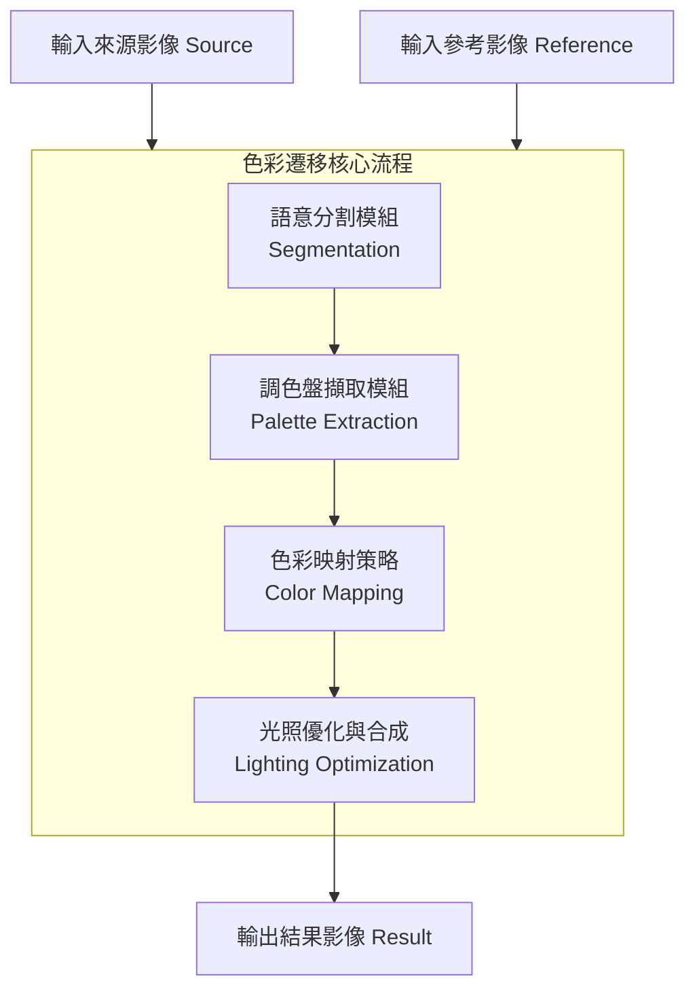

# 基於調色盤的影像色彩遷移系統 — 完整設計架構

本專案實作了 Chenlei Lv 與 Dan Zhang 於 2024 年發表的論文 《Palette-based Color Transfer between Images》 (arXiv:2405.08263)。系統透過自適應調色盤分群與語意分割技術，實現了高品質、語意一致的影像色彩遷移。

---

## 一、 系統整體架構 (System Architecture)

系統採用管線化 (Pipeline) 設計，將色彩遷移任務拆解為四個核心模組：

### 處理階段說明：
1. **語意分割**：分離影像的前景與背景，確保色彩遷移符合人類感官的語義邏輯。
2. **調色盤擷取**：自適應地從影像中提取代表性的色彩峰值，無需手動設定分群數。
3. **色彩映射**：建立來源與參考調色盤之間的對應關係，包含色差控制與一致性維護。
4. **光照優化**：融合原始亮度與目標色彩亮度，避免因參考圖曝光異常導致的畫質下降。

---

## 二、 核心模組詳細設計

### 1. 調色盤擷取模組 (Palette Extraction)
**類別**：`PaletteExtractor` (`color_transfer/palette.py`)

本模組捨棄傳統 K-Means 需要指定 K 值的缺點，採用自適應的直方圖峰值搜尋法。

- **直方圖建構**：將 Lab 色彩空間劃分為 $z$ 個分箱（預設 100）。
- **1D 峰值搜尋**：在各通道獨立搜尋局部最大值（搜尋半徑 $r=3$，最小閾值 $b_{min}=30$）。
- **3D 峰值合併**：利用 Cartesian 乘積組合三通道峰值為 3D 候選點，並透過 **kd-tree** 將像素分配至最近點。
- **動態過濾**：僅保留像素貢獻度最高的前 $t$ 個峰值（預設上限 32），確保調色盤的精簡與代表性。

### 2. 語意分割模組 (Segmentation)
**類別**：`segment_foreground` (`color_transfer/segmentation.py`)

為了達成「區域對區域」的精準遷移，系統引入語意分割技術。

- **深度學習模型**：採用 **DeepLabV3** (ResNet-101) 預訓練模型。
- **區域定義**：識別 VOC 標準下的前景物件與背景環境。
- **退化機制**：若環境未安裝 PyTorch 或模型偵測不到明確前景（< 1% 面積），系統會自動切換為全域處理模式（整張視為前景）。

### 3. 色彩映射策略 (Color Mapping)
**類別**：`ColorMapper` (`color_transfer/mapping.py`)

這是決定色彩風格轉換是否合理的關鍵步驟。

- **色差控制 (Chromatic Aberration Control)**：利用最近鄰搜尋 (Nearest Neighbor)，將來源峰值映射至 Lab 空間中距離最近的參考峰值。
- **內部一致性 (Internal Consistency)**：解決「多對一」映射問題。當多個來源色塊映射到同一參考色塊時，僅保留像素數最多的映射，其餘釋放以維持色彩多樣性。
- **外部連續性 (External Continuity)**：對釋放出的色塊，依據鄰近已映射色塊的距離倒數權重，重新加權計算映射值，確保色彩過渡自然。

### 4. 色彩套用與光照優化 (Transfer & Lighting)
**類別**：`transfer_color` (`color_transfer/transfer.py`)

- **色彩合成公式**：
  $$f(p_i) = f(b_i) + L(p_i) - b_i$$
  此公式在改變主色的同時，保留了像素與中心點的相對偏差，完美維持影像紋理細節。
- **光照權重混合 (Weighted L-update)**：
  色彩通道 ($a, b$) 完全採用遷移結果，而亮度通道 ($L$) 則採用加權融合：
  $$L_{final} = (1 - \alpha) L_{source} + \alpha L_{mapped}$$
  預設 $\alpha = 0.3$，這能有效引入參考圖的氛圍感，同時保留來源圖的曝光結構。

---

## 三、 技術棧與實作細節

### 開發環境
- **語言**：Python 3.8+
- **核心庫**：
    - `NumPy` & `SciPy`：矩陣運算與 kd-tree 空間檢索。
    - `OpenCV`：影像讀取、色彩空間轉換 (BGR ↔ Lab) 與輸出。
    - `PyTorch` & `torchvision`：語意分割模型推理。

### 軟體結構設計
- **低耦合設計**：各模組（調色盤、映射、分割）皆為獨立類別或函數，方便單元測試與演算法替換。
- **配置驅動**：透過 `TransferConfig` 統一管理超參數（如 `alpha`, `bins`, `max_palette`）。

---

## 四、 關鍵參數說明

| 參數名稱 | 符號 | 預設值 | 說明 |
| :--- | :--- | :--- | :--- |
| `bins` | $z$ | 100 | 色彩直方圖的解析度，影響峰值搜尋精細度。 |
| `max_palette` | $t$ | 32 | 調色盤色彩上限，值越高色彩越豐富但計算較慢。 |
| `lighting_alpha`| $\alpha$ | 0.3 | 亮度融合權重，0.3 代表保留 70% 原始亮度。 |
| `use_segmentation`| - | True | 是否啟用深度學習語意分割，關閉則為全域遷移。 |

---

## 五、 設計總結

本系統架構優點在於：
1. **全自動化**：不需使用者手動框選區域或指定色彩數量。
2. **語意感應**：透過 DeepLabV3 避免了「天空變草地」等不合理的色彩轉移。
3. **穩定性高**：藉由內部/外部一致性機制與光照混合技術，有效解決了色彩遷移中常見的色彩斷層與曝光過度問題。

---
*文件更新日期：2026年5月14日*
